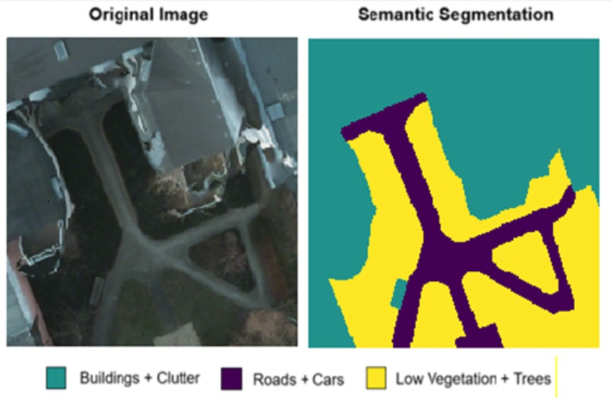

<div align="center">

<h1>SegUnify: A Unified Framework for Unsupervised Semantic Segmentation</h1>

<div>
    <a href='https://github.com/Prachi22031' target='_blank'>Prachi</a><sup>1</sup>&emsp;
    <a href='https://github.com/EkanshJuneja27' target='_blank'>Ekansh Juneja</a><sup>2</sup>&emsp;
</div>
<div>
    <sup>1</sup>prachi1916garg@gmail.com&emsp; 
    <sup>2</sup>ekansh.20004@gmail.com&emsp; 
</div>


</div>

## Abstract
> Semantic Segmentation is the process of assigning predefined classes to each pixel in an image. In Unsupervised Semantic Segmentation, no manual labels are provided, so the segmentation is performed by identifying patterns and correlations in the data. Earlier methods mainly used self-supervised learning or clustering to achieve semantic coherence. However, those methods often fail to maintain consistency between different parts of an image and make errors while segmenting complex images. This research aims to solve these limitations by introducing SegUnify, an integrated framework for semantic segmentation on unlabelled images. The model outperformed benchmarks on the Potsdam-3 dataset, achieving 82.74% accuracy and a mean IoU of 70.34%, surpassing existing methods. These results demonstrate the ability of SegUnify to produce more coherent and accurate segmentation maps, contributing to advancements in unsupervised semantic segmentation.


### Codes and Environment

```
# git clone this repository
git clone https://github.com/EkanshJuneja27/SegUnify.git
cd SegUnify

# create new anaconda env
conda create -n SegUnify python=3.10
conda activate SegUnify

# install pytorch
Install an appropriate pytorch version according to your cuda version. For example:
pip install torch==1.12.1+cu116 torchvision==0.13.1+cu116 torchaudio==0.12.1 --extra-index-url https://download.pytorch.org/whl/cu116

# install python dependencies
pip install -r requirements.txt
```

### Prepare Datasets
Change the `data_dir` variable to your data directory where datasets are stored.

```shell script
python download_datasets.py

cd /YOUR/PYTORCH/DATA/DIR

unzip potsdam.zip

python crop_datasets.py
```

### Checkpoints
Download the checkpoints from [[Google Drive](https://drive.google.com/file/d/1aBjwt_zIGtb5jPZvTomdpkA96biIR-Eq/view?usp=sharing)]
unzip the checkpoints in `checkpoints` folder.

### Model training
Hyperparameters can be modified in [`SmooSeg/configs/train_config.yaml`](configs/train_config.yaml).
```shell script
CUDA_VISIBLE_DEVICES="0" python train_segmentation.py
```

### Model evaluation
Some parameters `model_paths` and `data_dir` should be modified in [`SmooSeg/configs/eval_config.yaml`](configs/eval_config.yaml).
```shell script
python eval_segmentation.py
```

<div align="center">



</div>
